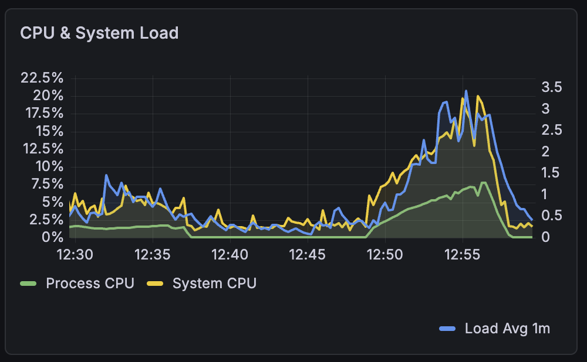
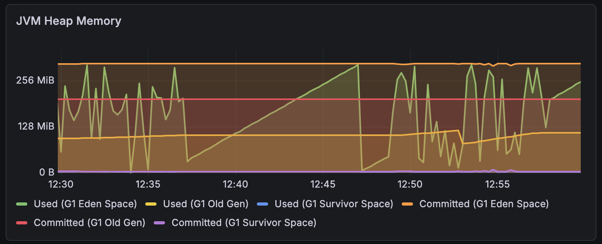
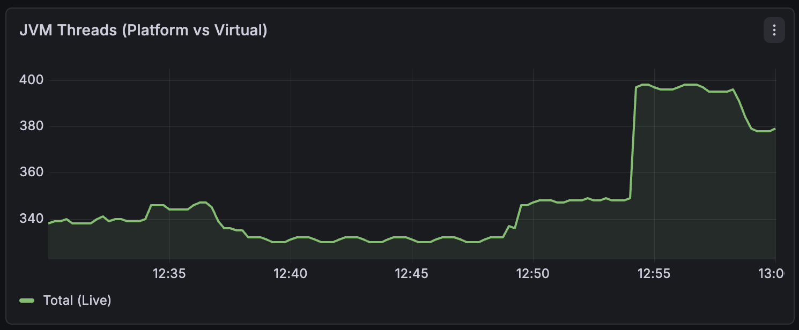

# E2E Ecosystem Demo

Full-scale demo showcasing **every CAPI feature** with **42 services** across 8 protocol/security types, a single-page UI, and end-to-end observability.

## Quick Start

```bash
cd demo-e2e

# Copy and fill in secrets
cp .env.example .env
# Edit .env with your passwords

# Start the demo
docker compose up -d

# Open the UI
open http://localhost
```

Wait ~60 seconds for Keycloak to initialize and all one-shot containers to complete.

## Architecture

| Container | Image | Purpose | Ports |
|-----------|-------|---------|-------|
| consul | hashicorp/consul:1.22 | Service discovery + KV | 8500 |
| keycloak | keycloak:26.1 | OIDC provider | 8080 |
| opa | openpolicyagent/opa:1.4.2 | Policy engine | 8181 |
| opensearch | opensearch:2.19.1 | Trace storage (security enabled) | 9200 |
| opensearch-dashboards | opensearch-dashboards:2.19.1 | Trace visualization | /dashboards |
| otel-collector | otel-collector-contrib | OpenTelemetry traces | 4317, 4318 |
| prometheus | prom/prometheus | Metrics scraping | 9090 |
| grafana | grafana/grafana | Metrics dashboards | /grafana |
| capi | surisoft/capi-core:latest | API Gateway | 8380, 8381, 8382, 8383, 8384 |
| generic-service | python:3-alpine | Single backend for 35 REST services | 8080 |
| websocket-service | python:3-alpine | WebSocket backend | 9090 |
| sse-service | python:3-alpine + Flask | SSE backend | 9091 |
| weather-service | python:3-alpine | MCP REST backend (weather) | 8080 |
| inventory-mcp-service | python:3-alpine | MCP REST backend (inventory) | 8080 |
| translate-service | python:3-alpine | MCP REST backend (translate) | 8080 |
| math-mcp-server | python:3-alpine | Native MCP Server (JSON-RPC) | 8080 |
| greeter-grpc | python:3-alpine + grpcio | gRPC backend | 50051 |
| bff | python:3-alpine + Flask + grpcio | OIDC auth, API/gRPC proxy | 5000 |
| nginx | nginx:alpine | UI + reverse proxy + SSL | 80, 443 |
| keycloak-setup | alpine/curl | One-shot: realm, clients, users, roles | - |
| registrar | alpine/curl | One-shot: 42 Consul registrations | - |
| apikey-setup | alpine/curl | One-shot: API keys in Consul KV | - |

### CAPI Gateway Ports

| Port | Protocol | Purpose |
|------|----------|---------|
| 8380 | HTTP/1.1 | REST API gateway |
| 8381 | HTTP/1.1 | Admin API (`/info`, `/info/mcp/tools`, etc.) |
| 8382 | HTTP/1.1 | WebSocket + SSE gateway |
| 8383 | HTTP/1.1 | MCP gateway (JSON-RPC 2.0) |
| 8384 | HTTP/2 | gRPC gateway |

## 42 Services by Type

### Open (5) — No authentication
`health-service`, `config-service`, `search-service`, `events-service`, `webhook-service`

### OPA-Protected (10) — Role-based via OPA policies
| Service | Policy | Allowed Roles |
|---------|--------|---------------|
| user, profile, catalog | `allow_all` | admin, manager, viewer |
| pricing, order | `manager_or_admin` | admin, manager |
| payment, invoice, audit | `admin_only` | admin |
| logging, storage | `owner_only` | admin |

### Subscription Groups (10) — JWT claim-based
| Group | Services |
|-------|----------|
| notifications | notification-service, preferences-service |
| recommendations | recommendation-service |
| messaging | email, sms, push, chat |
| partner | partner-api, marketplace, integration |

### API Key + Per-Key Throttle (5)
`inventory-service`, `shipping-service`, `returns-service`, `export-service`, `sync-service`

Three API keys per service (values in `.env`):
- `API_KEY_UNLIMITED` — no throttle
- `API_KEY_STANDARD` — 10 calls / 30s
- `API_KEY_LIMITED` — 3 calls / 30s

### Global Throttle (5)
| Service | Limit |
|---------|-------|
| metrics-service | 20 / 30s |
| reporting-service | 15 / 30s |
| dashboard-service | 10 / 30s |
| alerts-service | 10 / 30s |
| cache-service | 30 / 30s |

### WebSocket (1) — Secured + subscription group
`websocket-service` — subscription group: `notifications`

### SSE (1) — Secured + subscription group
`sse-service` — subscription group: `notifications`

### MCP Tools (4) — Model Context Protocol
| Service | Type | Tools |
|---------|------|-------|
| weather | REST backend | `weather_forecast` |
| inventory-mcp | REST backend | `inventory_lookup` |
| translate | REST backend | `translate_text` |
| math-mcp | Native MCP Server | `math_calculate`, `math_convert`, `math_statistics` (auto-discovered) |

MCP REST tools have their metadata (name, description, inputSchema) declared in Consul service meta.
MCP Server tools are auto-discovered via JSON-RPC `tools/list` — no Consul metadata needed.

### gRPC (1) — HTTP/2 proxying
`greeter` — `greeter.Greeter/SayHello` routed via `x-capi-service: greeter/dev` header.

## Security & Secrets

All passwords and secrets are externalized to a `.env` file (gitignored). Copy `.env.example` and fill in values before starting.

| Variable | Used by |
|----------|---------|
| `KC_ADMIN_USER` / `KC_ADMIN_PASSWORD` | Keycloak bootstrap |
| `ALICE_PASSWORD`, `BOB_PASSWORD`, `CHARLIE_PASSWORD` | Keycloak users, BFF direct login |
| `BFF_CLIENT_SECRET` | Keycloak BFF client, BFF |
| `PREMIUM_CLIENT_SECRET`, `BASIC_CLIENT_SECRET` | Keycloak subscription clients |
| `OPENSEARCH_PASSWORD` | OpenSearch, Dashboards, OTel Collector |
| `GRAFANA_PASSWORD` | Grafana admin login |
| `API_KEY_UNLIMITED/STANDARD/LIMITED` | API key setup, BFF config endpoint, UI |
| `BFF_SESSION_SECRET` | Flask session encryption |
| `EXTERNAL_URL` | Keycloak redirects, BFF callbacks |
| `SSL_DOMAIN` | Nginx server_name, cert volume |

## Keycloak Setup

- **Realm**: `e2e-demo`
- **Clients**: `demo-bff` (confidential, auth code flow), `client-premium` (all subs), `client-basic` (notifications only)
- **Users** (passwords from `.env`):
  - `alice` — admin role
  - `bob` — manager role
  - `charlie` — viewer role

## Observability

### Tracing (OpenTelemetry + OpenSearch)
- **OTel Collector** receives traces via OTLP (ports 4317/4318), exports to OpenSearch over HTTPS with basic auth
- **OpenSearch** with security plugin enabled (login required)
- **OpenSearch Dashboards** accessible at `/dashboards` (credentials from `.env`)

### Metrics (Prometheus + Grafana)
- **Prometheus** scrapes CAPI metrics from `:8381/info/metrics` every 15s
- **Grafana** accessible at `/grafana` with a pre-provisioned **CAPI Gateway** dashboard (credentials from `.env`)
- Dashboard panels: gateway request rate, total requests, JVM heap/non-heap memory, thread counts and states, CPU/system load, GC metrics, buffer pools

## UI Features

1. **Auth Panel** — Login as Alice/Bob/Charlie with one click
2. **Service Catalog** — 42 services grouped by type (Open, OPA, Subscriptions, API Key, Throttle, MCP), call any service directly
3. **Access Matrix** — Visual grid: services vs users with expected ALLOW/DENY
4. **WebSocket Tab** — Live feed of WebSocket pings with connect/disconnect
5. **SSE Tab** — Live Server-Sent Events stream with type filtering
6. **MCP Tab** — Interactive MCP testing: Initialize session, List Tools, Call Tool with JSON args
7. **gRPC Tab** — Call `greeter.Greeter/SayHello` through CAPI's gRPC gateway via BFF bridge
8. **Load Test** — Select services, concurrency, total requests; real-time 200/401/403/429 counters
9. **Request Log** — All requests logged with filterable status codes
10. **Gateway Config** — Modal showing the live CAPI configuration YAML

## Verification

1. Login as **Alice** (admin) → all services accessible
2. Login as **Charlie** (viewer) → OPA admin_only/manager_or_admin services return 403
3. Call API-key services with limited key → 429 after 3 calls
4. Call global-throttle services → 429 after hitting the limit
5. Open WebSocket tab → live pings (requires login)
6. Open SSE tab → live event stream (requires login)
7. Open MCP tab → Initialize → List Tools (6 tools) → Call any tool
8. Open gRPC tab → Call SayHello → response from greeter backend through CAPI
9. Run load test with 50+ requests → see real-time status code distribution
10. Open `/dashboards` → traces visible in OpenSearch
11. Open `/grafana` → CAPI Gateway dashboard with live metrics

## CLI Testing

```bash
# REST (open service)
curl http://localhost/api/health-service/v1

# REST (with Bearer token)
curl -H "Authorization: Bearer <token>" http://localhost/api/user-service/v1

# MCP (JSON-RPC)
curl -X POST http://localhost/mcp \
  -H "Content-Type: application/json" \
  -d '{"jsonrpc":"2.0","method":"initialize","id":1}'

# gRPC (direct, requires grpcurl)
grpcurl -plaintext \
  -H "x-capi-service: greeter/dev" \
  -import-path demo-e2e/services -proto greeter.proto \
  -d '{"name": "CAPI"}' \
  localhost:8384 greeter.Greeter/SayHello

# Admin API
curl http://localhost:8381/info/mcp/tools

# Prometheus metrics
curl http://localhost:8381/info/metrics
```

## Performance (single CAPI node, 1,195 req/s, 645K requests in 9 minutes)







- **~330 platform threads** — flat ceiling, no growth even at 1,195 req/s sustained
- **CPU usage at ~4%** — massive headroom remaining on a single node
- **Heap memory** — healthy G1 GC pattern, Eden cycling up to ~350 MiB, Old Gen stable
- **Buffer pools** — direct memory stable at ~4 MiB, no leak

CAPI uses Java virtual threads (Project Loom) for Camel thread pools and HTTP client executors. Virtual threads are invisible to JVM monitoring APIs, so the Grafana thread panel shows platform threads only.

## Load Testing (k6)

A [k6](https://k6.io/) test script is included at `k6/load-test.js`. It covers all protocol types with weighted random selection: open (30%), OPA (25%), subscription (20%), API key (10%), MCP (10%), gRPC (5%).

```bash
# Install k6 (macOS)
brew install k6

# Run against local demo
k6 run --env BASE_URL=http://localhost k6/load-test.js

# Run against remote with auth
k6 run \
  --env BASE_URL=https://your-domain.eu \
  --env ALICE_PASSWORD=<password> \
  --env BFF_SECRET=<secret> \
  --env API_KEY=<unlimited-key> \
  --env MAX_VUS=500 \
  k6/load-test.js

# Run a single scenario
k6 run --env BASE_URL=http://localhost --env SCENARIO=mcp k6/load-test.js
```

Available scenarios: `open`, `opa`, `subscription`, `apikey`, `mcp`, `grpc`, or `all` (default, weighted).

### k6 Results (single CAPI node, OVH datacenter France → remote server)

**100 VUs (9 minutes):**

| Metric | Value |
|--------|-------|
| Total requests | 130,352 |
| Throughput | 241 req/s |
| Success rate | 100% (0 failures) |
| p95 latency | 13.75ms |
| p50 latency | 10.24ms |

**500 VUs (9 minutes):**

| Metric | Value |
|--------|-------|
| Total requests | 645,592 |
| Throughput | 1,195 req/s |
| Success rate | 99.98% (159 failures / TCP timeouts during ramp) |
| p95 latency | 12.75ms |
| p50 latency | 9.87ms |

**Latency by protocol type (500 VUs, p95):**

| Protocol | p95 | Median | Max |
|----------|-----|--------|-----|
| Open (no auth) | 10.83ms | 9.76ms | 5.80s |
| OPA (role-based) | 10.91ms | 10.01ms | 7.25s |
| Subscription (JWT claim) | 11.02ms | 10.28ms | 7.24s |
| API Key + Throttle | 10.83ms | 9.78ms | 5.11s |
| MCP (JSON-RPC) | 10.84ms | 9.75ms | 35.85ms |
| gRPC (via BFF bridge) | 14.54ms | 13.20ms | 59.81ms |

All thresholds passed (p95 < 2s, error rate < 0.1%). MCP and gRPC had zero failures across both tests.

## Remote Deployment (your-domain.eu)

Set in `.env`:
```
EXTERNAL_URL=https://your-domain.eu
SSL_DOMAIN=your-domain.eu
```

Place SSL certs in `./your-domain.eu/fullchain1.pem` and `privkey1.pem`.

Nginx automatically redirects HTTP → HTTPS and serves ACME challenges for cert renewal.

## Cleanup

```bash
docker compose down -v
```