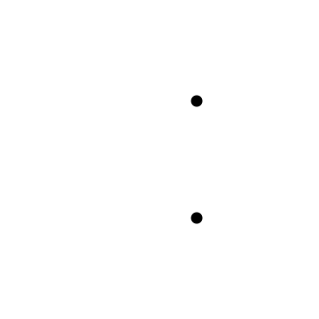

<p align="center">
  
</p>

# CAPI MCP Gateway Demo

Demonstrates CAPI acting as an MCP (Model Context Protocol) Gateway — aggregating both **plain REST services** and **real MCP Server backends** under one unified MCP endpoint for LLM clients like Claude Desktop, Cursor, and custom agents.

## What's inside

| Component | Type | Description |
|-----------|------|-------------|
| **CAPI Gateway** | Infrastructure | API gateway with MCP enabled on port 8383 |
| **Consul** | Infrastructure | Service discovery (port 8500) |
| **weather-service** | REST backend | Dummy REST API returning fake weather forecasts |
| **inventory-service** | REST backend | Dummy REST API returning fake product stock info |
| **translate-service** | REST backend | Dummy REST API returning fake translations |
| **math-mcp-server** | **MCP Server** | Real MCP Server (JSON-RPC 2.0) with math tools |
| **greeter-grpc** | gRPC backend | Dummy gRPC Greeter service (HTTP/2, port 50051) |
| **registrar** | Setup | One-shot container that registers services in Consul |

### Two types of backends

- **REST backends** (weather, inventory, translate): Plain REST APIs that know nothing about MCP. Tools are declared in Consul metadata (`mcp-tools`, `mcp-tools-{name}-description`, etc). CAPI sends plain HTTP POST with arguments and wraps the response.

- **MCP Server backends** (math): Real MCP Servers that speak JSON-RPC 2.0. Registered in Consul with `mcp-type: server` — no tool metadata needed. CAPI discovers tools automatically via `tools/list` and forwards `tools/call` as JSON-RPC. Responses are passed through as-is (already MCP-formatted).

- **gRPC backends** (greeter): Standard gRPC services. Registered in Consul with `type: grpc`. CAPI proxies them transparently over HTTP/2 via the gRPC Gateway (port 8384). Clients specify the target service using the `x-capi-service` header.

## Quick start

```bash
# From the demo/ directory
docker compose up --build -d

# Wait ~10 seconds for CAPI to discover the services, then run the demo
chmod +x test-mcp.sh
./test-mcp.sh
```

## What the demo shows

The `test-mcp.sh` script walks through the full MCP lifecycle:

1. **Initialize** — creates an MCP session (JSON-RPC `initialize`)
2. **Ping** — verifies the connection (JSON-RPC `ping`)
3. **List tools** — CAPI returns 6 tools from 4 backends (JSON-RPC `tools/list`)
4. **Call weather_forecast** — REST backend: CAPI POSTs arguments, wraps response
5. **Call inventory_lookup** — REST backend: same flow
6. **Call math_calculate** — MCP Server backend: CAPI sends JSON-RPC `tools/call`, passes result through
7. **Call math_convert** — MCP Server backend: same flow

## Architecture

```
LLM Client                    CAPI                        Backend Services
(Claude Desktop,       JSON-RPC 2.0 / HTTP
 Cursor, etc.)
                      +------------------+
  initialize  ------->|                  |         REST backends (plain HTTP POST)
  tools/list  ------->|   MCP Gateway    |-------->  weather-service
  tools/call  ------->|   (port 8383)    |-------->  inventory-service
                      |                  |-------->  translate-service
                      |   Consul         |
                      |   Discovery      |         MCP Server backends (JSON-RPC 2.0)
                      |                  |-------->  math-mcp-server
                      +------------------+

                      +------------------+
  grpcurl   --------->|  gRPC Gateway    |         gRPC backends (HTTP/2)
  (h2c)               |  (port 8384)     |-------->  greeter-grpc
                      +------------------+
```

## Connect Claude Desktop

Claude Desktop's config file only supports locawhl stdio servers. To connect to CAPI's remote HTTP endpoint, use the `mcp-remote` npm package as a bridge.

Add to `~/Library/Application Support/Claude/claude_desktop_config.json`:

```json
{
  "mcpServers": {
    "capi-gateway": {
      "command": "npx",
      "args": ["-y", "mcp-remote", "http://localhost:8383/mcp"]
    }
  }
}
```

> **Requires**: Node.js installed. The `npx -y` flag auto-installs `mcp-remote` on first use.

Restart Claude Desktop. It will discover the tools and use them in conversation.

Try asking: _"What's the weather in Lisbon? Also check if laptops are in stock and calculate sqrt(256) * 3."_

## Connect MCP Inspector

```bash
npx @modelcontextprotocol/inspector
```

Select **Streamable HTTP** transport and enter `http://localhost:8383/mcp`.

## Admin API

```bash
# MCP status
curl -s http://localhost:8381/info/mcp | jq .

# Tool catalog
curl -s http://localhost:8381/info/mcp/tools | jq .

# Active sessions
curl -s http://localhost:8381/info/mcp/sessions | jq .

# All CAPI endpoints
curl -s http://localhost:8381/info | jq .
```

## Adding your own services

### REST backend (tools defined in Consul metadata)

```bash
curl -X PUT http://localhost:8500/v1/agent/service/register \
  -H "Content-Type: application/json" \
  -d '{
    "Name": "my-service",
    "Port": 3000,
    "Address": "host.docker.internal",
    "Meta": {
      "group": "v1",
      "root-context": "/",
      "scheme": "http",
      "type": "rest",
      "capi-instance": "default",
      "secured": "false",
      "mcp-enabled": "true",
      "mcp-toolPrefix": "myservice",
      "mcp-tools": "action",
      "mcp-tools-action-description": "Does something useful",
      "mcp-tools-action-inputSchema": "{\"type\":\"object\",\"properties\":{\"input\":{\"type\":\"string\"}},\"required\":[\"input\"]}"
    }
  }'
```

CAPI will discover it within 5 seconds and expose it as `myservice_action`.

### MCP Server backend (tools discovered automatically)

```bash
curl -X PUT http://localhost:8500/v1/agent/service/register \
  -H "Content-Type: application/json" \
  -d '{
    "Name": "my-mcp-server",
    "Port": 3000,
    "Address": "host.docker.internal",
    "Meta": {
      "group": "v1",
      "root-context": "/",
      "scheme": "http",
      "type": "rest",
      "capi-instance": "default",
      "secured": "false",
      "mcp-enabled": "true",
      "mcp-type": "server",
      "mcp-toolPrefix": "mytools",
      "mcp-category": "custom"
    }
  }'
```

No `mcp-tools` metadata needed. CAPI will connect to your MCP Server, call `initialize` + `tools/list`, and expose all discovered tools with the `mytools_` prefix.

## Test gRPC Gateway

The gRPC Gateway uses header-based routing. Clients specify the target service with the `x-capi-service` header (`<serviceName>/<group>`), and the gRPC path is forwarded as-is to the backend.

```bash
# Call the greeter service (requires grpcurl and the proto file)
grpcurl -plaintext \
  -H "x-capi-service: greeter/dev" \
  -import-path demo/services -proto greeter.proto \
  -d '{"name": "CAPI"}' \
  localhost:8384 greeter.Greeter/SayHello
```

Expected response:

```json
{
  "message": "Hello, CAPI! Greetings from the CAPI gRPC demo."
}
```

> **Note**: The `-import-path` and `-proto` flags are required because gRPC server reflection uses bidirectional streaming, which Undertow's proxy does not support. Providing the proto file directly uses unary RPCs, which work correctly.

### Registering your own gRPC service

```bash
curl -X PUT http://localhost:8500/v1/agent/service/register \
  -H "Content-Type: application/json" \
  -d '{
    "Name": "my-grpc-service",
    "ID": "my-grpc-service-1",
    "Port": 50051,
    "Address": "my-grpc-host",
    "Meta": {
      "group": "dev",
      "root-context": "/",
      "scheme": "http",
      "type": "grpc",
      "capi-instance": "default",
      "secured": "false"
    }
  }'
```

Then call it:

```bash
grpcurl -plaintext \
  -H "x-capi-service: my-grpc-service/dev" \
  -import-path /path/to/protos -proto my_service.proto \
  -d '{}' \
  localhost:8384 mypackage.MyService/MyMethod
```

## Cleanup

```bash
docker compose down -v
```
